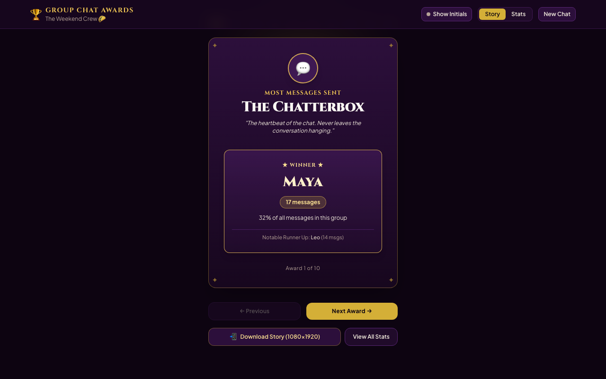

# Group Chat Awards

Drop in your WhatsApp group chat export. Get an awards night for the group: who talks most, who never replies, who sends voice notes at 3am.

**Live site:** https://group-chat-awards.vercel.app



## Features

- **Gala Ceremony Story**: Mobile-optimized, tap-through awards show with gold foil typography and an envelope reveal animation under a sweeping spotlight.
- **10+ Bespoke Awards**:
  - **The Chatterbox**: Most messages sent
  - **The Night Owl**: Most active between 12 AM and 5 AM
  - **The Early Bird**: Most active between 5 AM and 8 AM
  - **The Novelist**: Longest message lengths and longest single monologue
  - **The Ghost**: Fewest messages and lowest participation ratio
  - **Fastest Reply**: Quickest median response time to others
  - **The Resuscitator**: Most messages sent after long group silences (> 6 hours)
  - **Emoji Royalty**: Highest count of emojis used
  - **The Media Mogul**: Most photos, videos, voice notes, stickers, and documents
  - **The Laugh Track**: Most laughs ("haha", "lol", "lmao", 😂, 🤣)
- **1080×1920 Story Cards**: Native, client-side Canvas 2D export generated directly in full resolution for Instagram and WhatsApp Stories.
- **Privacy Mode**: One-click toggle to show initials instead of real names across all awards and statistics.
- **Group Activity Digest**:
  - Total messages, active days, participant count, and busiest single day
  - 24×7 Hour-by-Weekday activity heatmap
  - Top words with common stop-words removed
  - Message volume leaderboard
- **Built-in Sample Chat**: Explore the full awards night instantly with a single click.

## Privacy & Security

Everything runs 100% inside your browser. No messages, contacts, media, or chat data are ever uploaded, transmitted, or stored on any server.

## Tech Stack

- **Framework**: Vue 3 (`<script setup>`, Composition API)
- **Tooling**: Vite + TypeScript (strict mode)
- **Styling**: Tailwind CSS v4 (`@tailwindcss/vite`) with custom Gala design tokens
- **Typography**: Self-hosted `@fontsource/cinzel` and `@fontsource/plus-jakarta-sans`
- **ZIP Extraction**: `fflate`
- **Testing**: Vitest for unit tests; Playwright & `@axe-core/playwright` for acceptance and accessibility testing

## Environment Variables

None.

## Getting Started

```bash
# Install dependencies
pnpm install

# Start local dev server
pnpm dev

# Typecheck
pnpm typecheck

# Lint
pnpm lint

# Unit tests
pnpm test

# E2E acceptance tests
pnpm e2e

# Production build
pnpm build
```

## License

MIT © Muttaqi
